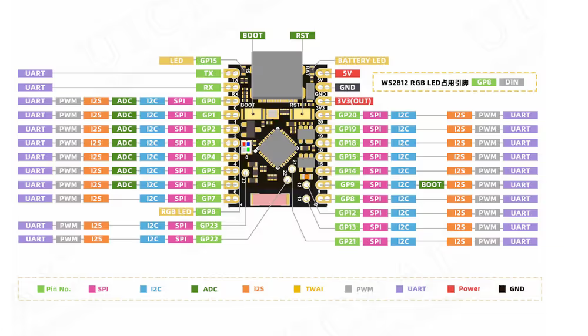

## Dev Board

### Pinout

ESP32 C6 Zero

                     |    |
              =======|    |=======
              | 5V            TX |
              | GND           RX |
              | 3V3           14 |  DOUT
              | 0             15 |  BCLK
      BUTTON  | 1             18 |  WS
      MAGLOCK | 2             19 |  CS
              | 3             20 |  SCLK
              | 4             21 |  MOSI
              | 5             22 |  MISO
              ====================

ESP32 C6 SuperMini

                     |    |
              =======|    |=======
              | TX            5V |
              | RX           GND |
              | 0            3V3 |
      BUTTON  | 1             20 |
      MAGLOCK | 2             19 |  MISO       (blue)
              | 3             18 |  MOSI       (blue white)
              | 4             15 |  SCLK       (green)
       LRC/WS | 5             14 |  CS/SDA     (green white)
         BCLK | 6              9 |  Boot DON'T USE
         DOUT | 7              8 |  Built-in LED
              ====================

### Sounds

- startup.mp3
- open.mp3
- close.mp3
- latchon.mp3
- latchoff.mp3
- success.mp3
- failure.mp3
